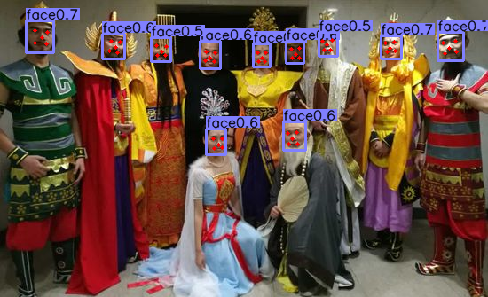

# CenterNet

> 使用CenterNet来训练其他数据。

## 本项目实现以下

* **Face** 人脸bbox+landmark检测
* **SeaShips** 船只种类和bbox检测

## 代码参考以下

>[Objects as Points](https://github.com/xingyizhou/CenterNet)
>
>[CenterMulti](https://github.com/bleakie/CenterMulti)
>
>[CenterPose](https://github.com/tensorboy/centerpose)

## 结果

### Face

测试：使用原图分辨率，未使用Multi Scale，在验证集上进行测试。

| Backbone     | AP   | AP50 | AP75 | APS | APM | APL |
| ------------ | ---- | --------------- | --------------- | -------------- | -------------- | -------------- |
| DLA-34       | 43.7 | 73.7            | 47.7            | 31.9           | 58.8           | 64.0           |
| MobileNet-V2 | 34.3 | 62.0            | 35.0            | 27.2           | 52.4           | 42.7           |

### SeaShips

测试：使用原图分辨率，未使用Multi Scale，在验证集和测试集上进行测试。

| Backbone | 数据集 | AP   | AP50 | AP75 | APS | APM | APL |
| -------- | ------ | ---- | --------------- | --------------- | -------------- | -------------- | -------------- |
| DLA-34   | Val    | 21.3 | 37.3            | 21.5            | 10.8           | 39.3           | 22.1           |
| DLA-34   | Test   | 21.6 | 36.4            | 23.5            | 2.7            | 32.4           | 22.8           |

## 训练和测试

* 详见文档 [Face](readme/Face.md)
* 详见文档 [SeaShips](readme/Seaships.md)
